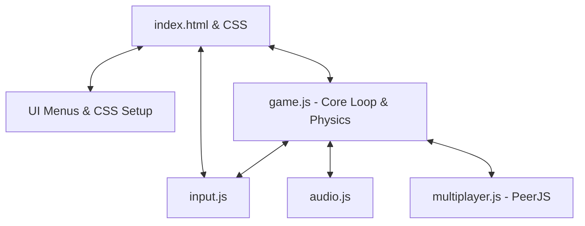

# System Patterns - Smashturbanda

## Architecture Overview

Smashturbanda is structured as a client-side web application leveraging an HTML5 Canvas for game rendering and standard DOM elements for user interfaces (overlays, settings menus, and sidebars).

## Component Breakdown

1. **Core Loop & Physics (`game.js`)**:
   - Manages state of players, projectiles, particles, platforms, and match criteria.
   - Calculates collisions, knockback velocities, gravity, and bounds checking (blast zones).
   - Renders all visual frames on the `<canvas>` context.

2. **Input Manager (`input.js`)**:
   - Captures keyboard key events and polls the Gamepad API.
   - Maps inputs logically per player slot.
   - Merges inputs from multiple sources (keyboard + controller) using logical OR.

3. **Multiplayer/Network Layer (`multiplayer.js`)**:
   - Uses WebRTC (via PeerJS) for peer-to-peer data transport.
   - Implements Host/Guest architecture: Host runs the authoritative game simulation; Guest sends compressed input states (changes only) and receives compressed player state tuples.

4. **Audio Engine (`audio.js`)**:
   - Manages AudioContext, sound generation, volume controls, and sound effect triggers.

5. **Styling & HUD (`styles.css` / `index.html`)**:
   - Renders fighting game HUD elements (Player damage percentage, stocks, timer) over the canvas.
   - All page graphical and visual elements must strictly follow the guidelines and design systems described in [design.md](file:///home/zinko/publico/smashturbanda/design.md).

## Key Technical Decisions
- **Tuples for State Compression**: State synchronization across WebRTC uses array-based tuples rather than heavy JSON objects, reducing network payload sizes by ~75%.
- **Authoritative Host Simulation**: The Host runs the master game loop, preventing state desynchronization.
- **Delta Input Messaging**: Guest clients only transmit input updates when a key state changes, minimizing upstream network congestion.
